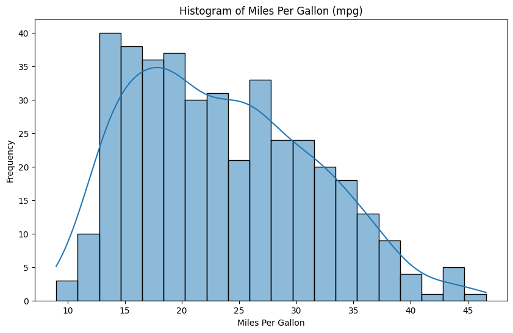

## Python and Markdown

This is an Markdown document. Markdown is a simple formatting syntax for authoring HTML, PDF, and MS Word documents.


```python
import pandas as pd
import seaborn as sns

# Załaduj wbudowany zestaw danych 'mpg' z seaborn, który jest podobny do 'cars'
cars = sns.load_dataset('mpg')

# Wyświetl pierwsze kilka wierszy danych
print(cars.head())

# Uzyskaj podsumowanie statystyczne danych
summary = cars.describe()
print(summary)
```

        mpg  cylinders  displacement  horsepower  weight  acceleration  \
    0  18.0          8         307.0       130.0    3504          12.0   
    1  15.0          8         350.0       165.0    3693          11.5   
    2  18.0          8         318.0       150.0    3436          11.0   
    3  16.0          8         304.0       150.0    3433          12.0   
    4  17.0          8         302.0       140.0    3449          10.5   
    
       model_year origin                       name  
    0          70    usa  chevrolet chevelle malibu  
    1          70    usa          buick skylark 320  
    2          70    usa         plymouth satellite  
    3          70    usa              amc rebel sst  
    4          70    usa                ford torino  
                  mpg   cylinders  displacement  horsepower       weight  \
    count  398.000000  398.000000    398.000000  392.000000   398.000000   
    mean    23.514573    5.454774    193.425879  104.469388  2970.424623   
    std      7.815984    1.701004    104.269838   38.491160   846.841774   
    min      9.000000    3.000000     68.000000   46.000000  1613.000000   
    25%     17.500000    4.000000    104.250000   75.000000  2223.750000   
    50%     23.000000    4.000000    148.500000   93.500000  2803.500000   
    75%     29.000000    8.000000    262.000000  126.000000  3608.000000   
    max     46.600000    8.000000    455.000000  230.000000  5140.000000   
    
           acceleration  model_year  
    count    398.000000  398.000000  
    mean      15.568090   76.010050  
    std        2.757689    3.697627  
    min        8.000000   70.000000  
    25%       13.825000   73.000000  
    50%       15.500000   76.000000  
    75%       17.175000   79.000000  
    max       24.800000   82.000000  


## Including Plots

You can also embed plots, for example:


```python
import matplotlib.pyplot as plt
plt.figure(figsize=(10, 6))
sns.histplot(cars['mpg'], bins=20, kde=True)
plt.title('Histogram of Miles Per Gallon (mpg)')
plt.xlabel('Miles Per Gallon')
plt.ylabel('Frequency')
plt.show()
```


    

    


# Pipe

To use the pipe operator in Python with the cars dataset, you can follow the example below. We'll use the pandas library and the pipe method to achieve similar functionality to the %>% operator in R.

Pipe is a module in Python that easily connects the output from one method with the output from another method. It is a library that helps in writing cleaner code.

A few functions in the pipe library are similar to SQL commands. For example, the usage of where and select as illustrated in the figures above. Let’s discuss them in more detail.

## dfply library

The dfply package makes it possible to do R's dplyr-style data manipulation with pipes in python on pandas DataFrames.

[dfply website here](https://github.com/kieferk/dfply)

## Select

The select method is similar to the map function in Python. It also has the same functionality.


```python
from dfply import *
cars >> head(3)
```


<div>
<style scoped>
    .dataframe tbody tr th:only-of-type {
        vertical-align: middle;
    }

    .dataframe tbody tr th {
        vertical-align: top;
    }

    .dataframe thead th {
        text-align: right;
    }
</style>
<table border="1" class="dataframe">
  <thead>
    <tr style="text-align: right;">
      <th></th>
      <th>mpg</th>
      <th>cylinders</th>
      <th>displacement</th>
      <th>horsepower</th>
      <th>weight</th>
      <th>acceleration</th>
      <th>model_year</th>
      <th>origin</th>
      <th>name</th>
    </tr>
  </thead>
  <tbody>
    <tr>
      <th>0</th>
      <td>18.0</td>
      <td>8</td>
      <td>307.0</td>
      <td>130.0</td>
      <td>3504</td>
      <td>12.0</td>
      <td>70</td>
      <td>usa</td>
      <td>chevrolet chevelle malibu</td>
    </tr>
    <tr>
      <th>1</th>
      <td>15.0</td>
      <td>8</td>
      <td>350.0</td>
      <td>165.0</td>
      <td>3693</td>
      <td>11.5</td>
      <td>70</td>
      <td>usa</td>
      <td>buick skylark 320</td>
    </tr>
    <tr>
      <th>2</th>
      <td>18.0</td>
      <td>8</td>
      <td>318.0</td>
      <td>150.0</td>
      <td>3436</td>
      <td>11.0</td>
      <td>70</td>
      <td>usa</td>
      <td>plymouth satellite</td>
    </tr>
  </tbody>
</table>
</div>


